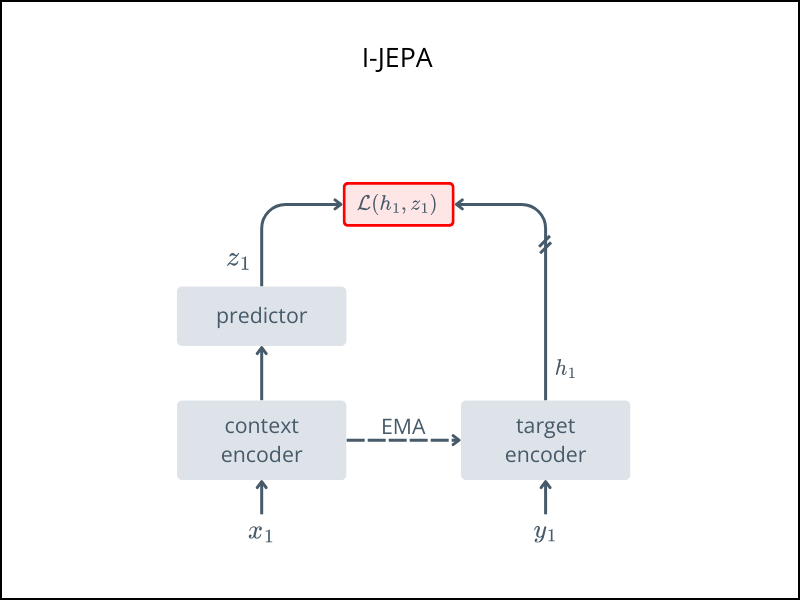

# 🧠 I-JEPA

*Self-Supervised Learning with an Image Joint-Embedding Predictive Architecture*

This folder contains the implementation of **I-JEPA**, a self-supervised method that learns abstract representations by predicting latent features of masked regions using visible context — without pixel-level reconstruction.

> 📄 Paper\
> https://arxiv.org/abs/2301.08243 published in CVPR 2023.


## Overview
I-JEPA departs from pixel-level or patch reconstruction (like MAE) and instead predicts feature embeddings of masked regions based on visible context — enabling a higher-level, more semantic learning signal.

For a conceptual overview:
- [Review: I-JEPA - Meta](https://ai.meta.com/blog/yann-lecun-ai-model-i-jepa/)  


## Architecture



- Divide image into patches

- Mask a subset of patches (targets)

- A **context encoder** processes visible patches

- A **predictor** estimates the target embeddings

- The targets come from a **frozen target encoder** applied to the masked patches

- Loss is computed in feature space, not pixel space

## Usage

Run pretraining with:
```bash
python train.py --norm_pix_loss
```

After pretraining
- ✅ Keep the context encoders
- ❌ Discard the target encoder and predictor head