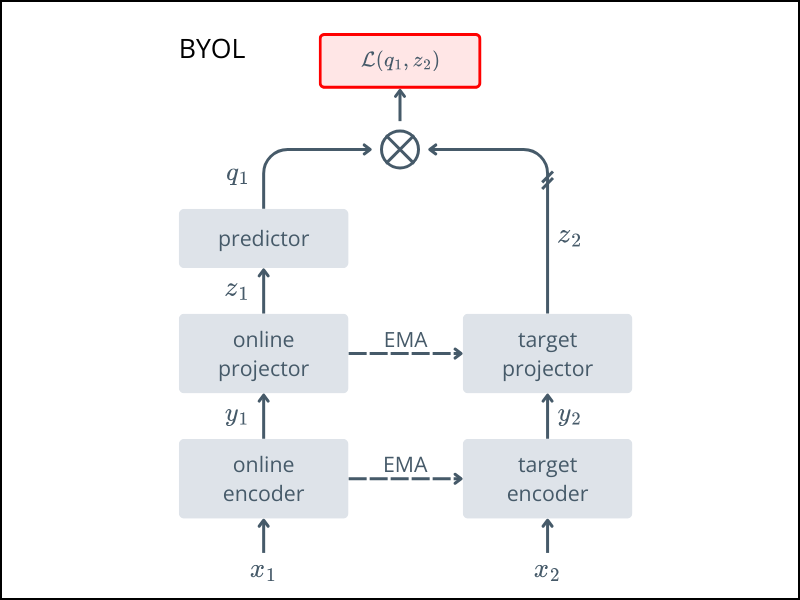

# 🌀 BYOL

*Bootstrap Your Own Latent*

This folder contains the implementation of **BYOL (Bootstrap Your Own Latent)**, a self-supervised learning method that avoids negative pairs by leveraging asymmetric networks and a moving-average target.

> 📄 Paper\
> https://arxiv.org/abs/2006.07733 published in NeurIPS 2020.

## Overview
BYOL learns visual representations by predicting the representation of one augmented view from another, using a moving-average copy of the network as a stable target.

For an intuitive explanation: 
- [Review: BYOL - Medium](https://sh-tsang.medium.com/review-byol-bootstrap-your-own-latent-a-new-approach-to-self-supervised-learning-6f770a624441)  


## Architecture



- $x_1$ and $x_2$: two augmented views of the same image
- **Online network** (encoder → projector → predictor)
- **Target network** (encoder → projector)
- The online network tries to predict the target's output; gradients flow only through the online branch

## Usage

Start pretraining with:
```bash
python train.py 
```

After pretraining
- ✅ Keep the encoder
- ❌ Discard the projector and predictor