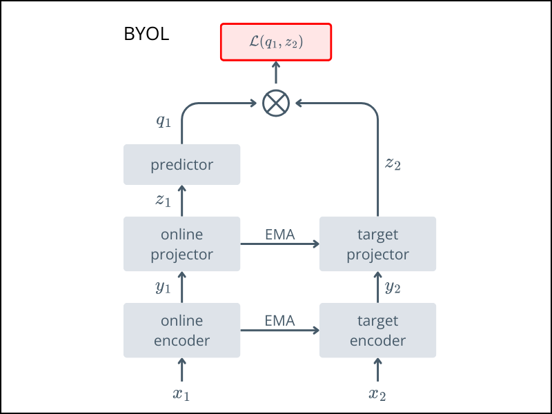

# Bootstrap your own latent
This implementation contains the code for **Bootstrap your own latent (BYOL)**.
- https://arxiv.org/abs/2006.07733 published in NeurIPS 2020.

For conceptual overviews, see:  
- [Review: BYOL](https://sh-tsang.medium.com/review-byol-bootstrap-your-own-latent-a-new-approach-to-self-supervised-learning-6f770a624441)  


## Architecture



$x_1$ and $x_2$ are two different augmented views of same image.

## Usage

Train using the `train.py` script:

Pretrain with:

```bash
python train.py 
```

After pretraining
- ✅ Keep the encoder
- ❌ Discard the target network, projector, and predictor