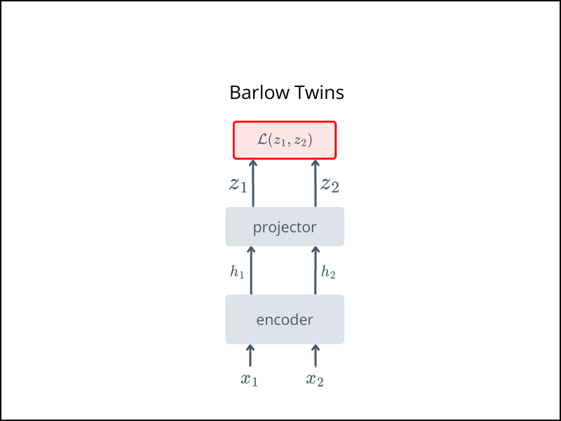

# Barlow Twins
This implementation contains the code for **Barlow Twins**.
- https://arxiv.org/abs/2103.03230 published in ICML 2021.

For conceptual overviews, see:  
- [Review: Barlow Twins](https://medium.com/@nazimbendib/paper-explained-barlow-twins-self-supervised-learning-via-redundancy-reduction-barlow-twins-92c90b49b21e)  


## Architecture



$x_1$ and $x_2$ are two different augmented views of same image.

## Usage

Train using the `train.py` script:

Pretrain with:

```bash
python train.py 
```

After pretraining
- ✅ Keep the encoder
- ❌ Discard the target network, projector, and predictor