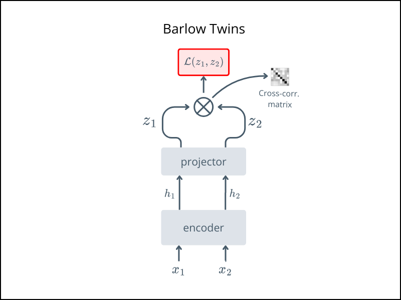

# 🌀 Barlow Twins

*Self-Supervised Learning via Redundancy Reduction*

> 📄 Paper\
> https://arxiv.org/abs/2103.03230 published in ICML 2021.


## Overview
Barlow Twins proposes a loss function that aligns the embeddings of two augmented views while reducing redundancy by pushing off-diagonal entries of their cross-correlation matrix toward zero.


For an intuitive explanation: 
- [Review: Barlow Twins - Medium](https://medium.com/@nazimbendib/paper-explained-barlow-twins-self-supervised-learning-via-redundancy-reduction-barlow-twins-92c90b49b21e)  


## Architecture



- $x_1$, $x_2$: two augmented versions of the same image
- Pass through the same **encoder** and **projector**
- Compute the **cross-correlation matrix** between the two embeddings
- Loss has two terms:
    - On-diagonal -> forces similarity
    - Off-diagonal -> discourages redundancy

## Usage

Run pretraining with:
```bash
python train.py 
```

After pretraining
- ✅ Keep the encoder
- ❌ Discard the projector