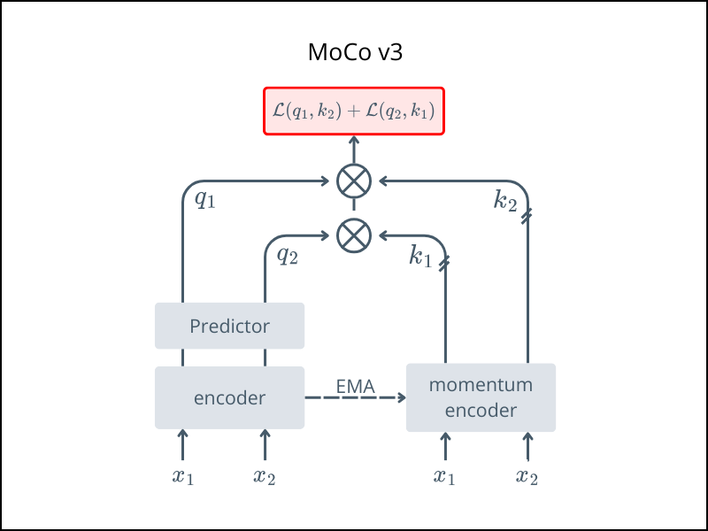

# 🌀 MoCo

*Momentum Contrast for Unsupervised Visual Representation Learning*

This folder contains the implementation of **MoCo (Momentum Contrast)**, a contrastive learning framework with a momentum-updated encoder.

> 📄 Papers\
> v1: https://arxiv.org/abs/1911.05722 published in CVPR 2020.\
> v2: https://arxiv.org/abs/2003.04297\
> v3: https://arxiv.org/abs/2104.02057 published in ICCV 2021.


## Overview
MoCo learns representations by contrasting positive pairs (different views of the same image) against a large set of negative examples. It introduces a momentum encoder to maintain a consistent dictionary for contrast.

For a conceptual breakdown: 
- [From MoCo v1 to v3 - Medium](https://medium.com/data-science/from-moco-v1-to-v3-towards-building-a-dynamic-dictionary-for-self-supervised-learning-part-1-745dc3b4e861).

---

## Architecture



- $x_1$, $x_2$: two augmented views of the same image
- Two encoders:
    - **Query encoder** (updated via backprop)
    - **Key encoder** (updated via momentum)
- Contrastive loss pulls together $(x_1, x_2)$ pairs
## Usage

Start pretraining with:
```bash
python train.py 
```
Once pretraining is finished:
- ✅ Keep the query encoder for downstream tasks
- ❌ Discard the momentum encoder and the projection head
