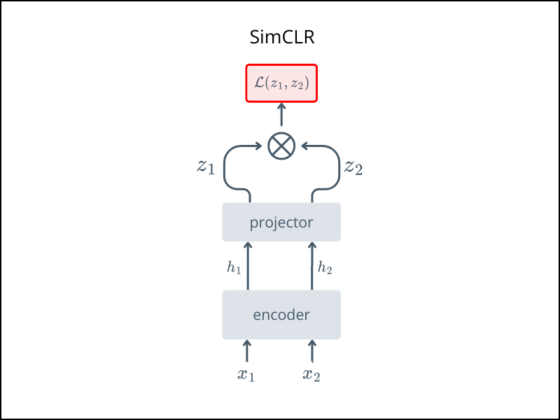

# Simple Framework for Contrastive Learning of Visual Representations
This implementation contains the code for **SimCLR**, a simple framework for contrastive learning of visual representations.

- v1: https://arxiv.org/abs/2002.05709 published in ICML 2020.
- v2: https://arxiv.org/abs/2006.10029 published in NeurIPS 2020.

> [!NOTE]
> SimCLR v2 proposes a deeper projector and focuses on scaling and evaluating SimCLR pretraining.


For conceptual overviews, see:  
- [Review: SimCLR v1](https://sh-tsang.medium.com/review-simclr-a-simple-framework-for-contrastive-learning-of-visual-representations-5de42ba0bc66)  
- [Review: SimCLR v2](https://medium.com/@sh-tsang/review-simclrv2-big-self-supervised-models-are-strong-semi-supervised-learners-bf65be0183e4)


> [!NOTE]
> For training it is important to ensure that the mini-batch contains balanced amount of samples from classes.
## Architecture




## Usage

Train using the `train.py` script:

Pretrain with:

```bash
python train.py 
```

After pretraining
- ✅ Keep the encoder
- ❌ Discard the projection head