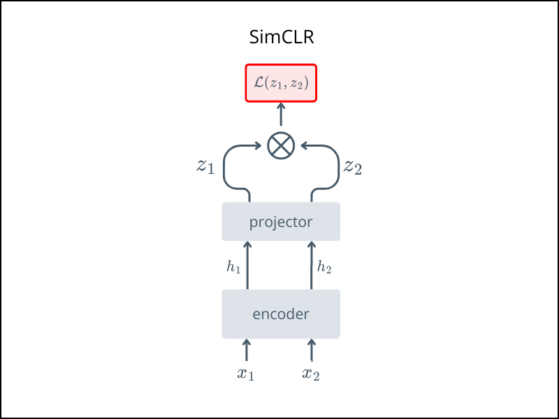

# 🌀 SimCLR
*A Simple Framework for Contrastive Learning of Visual Representations*

This folder contains the implementation of **SimCLR**, a self-supervised learning method that uses contrastive learning to learn visual representations without labels.

> 📄 Papers\
> v1: https://arxiv.org/abs/2002.05709 published in ICML 2020.\
> v2: https://arxiv.org/abs/2006.10029 published in NeurIPS 2020.

> [!NOTE]
> SimCLR v2 proposes a deeper projector and focuses on scaling and evaluating SimCLR pretraining.

## Overview
SimCLR trains a neural network to maximize agreement between two augmented views of the same image in the latent space, using a contrastive loss.

To understand the intuition and differences between v1 and v2: 
- [Review: SimCLR v1 - Medium](https://sh-tsang.medium.com/review-simclr-a-simple-framework-for-contrastive-learning-of-visual-representations-5de42ba0bc66)  
- [Review: SimCLR v2 - Medium](https://sh-tsang.medium.com/review-simclrv2-big-self-supervised-models-are-strong-semi-supervised-learners-bf65be0183e4)


## Architecture



- $x_1$, $x_2$: two augmented views of the same image

- Shared encoder extracts features

- A lightweight projection head maps to contrastive space

- Contrastive loss pulls together positive pairs and pushes apart negatives

## Usage

Run pretraining with:
```bash
python train.py 
```
Once pretraining completes:

- ✅ Keep the encoder (as your feature extractor)

- ❌ Discard the projection head