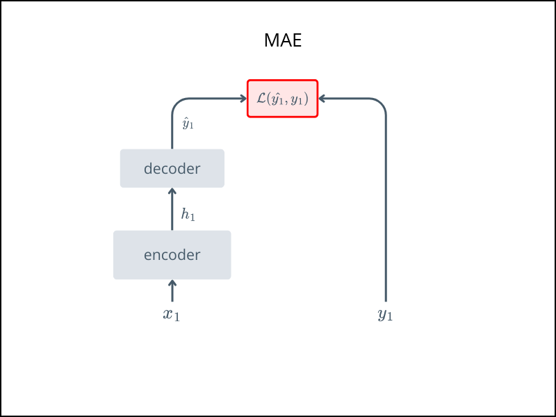

# 🧩 MAE

*Masked Autoencoders for Self-Supervised Vision Pretraining*

This folder contains the implementation of MAE, a self-supervised method that learns to reconstruct masked portions of an image, inspired by masked language modeling in NLP.

> 📄 Paper\
> https://arxiv.org/abs/2111.06377 published in CVPR 2022.


## Overview
MAE masks a large portion (e.g., 75%) of the image patches and trains a model to reconstruct the missing parts. This encourages the model to build rich internal representations, useful for downstream tasks.

For an intuitive explanation: 
- [Review: MAE - Medium](https://sh-tsang.medium.com/review-masked-autoencoders-are-scalable-vision-learners-b7c42910f7b4)  


## Architecture



- Input image is divided into patches

- A high ratio (e.g., 75%) of patches are masked randomly

- Encoder processes only the visible patches

- Decoder tries to reconstruct the original image from the sparse latent representation

- Loss is computed between the reconstructed and original masked patches

## Usage

Run pretraining with:
```bash
python train.py --norm_pix_loss
```

After pretraining
- ✅ Keep the encoder
- ❌ Discard the decoder